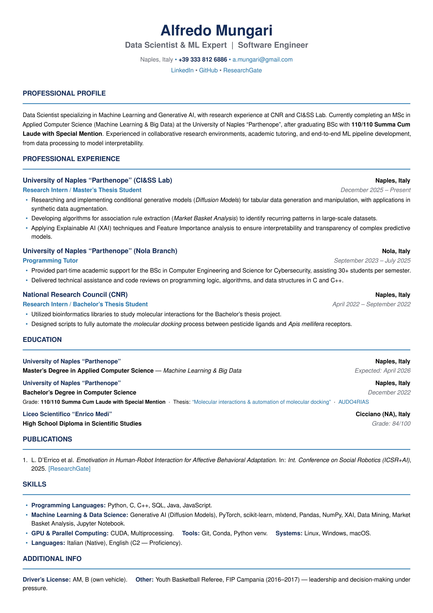

# Alfredo Mungari — Curriculum Vitae

This repository contains the LaTeX source code and the compiled PDF of my curriculum vitae.

[Download the PDF](CV_Alfredo_Mungari.pdf)

---

## Preview

<p align="center">
  <a href="CV_Alfredo_Mungari.pdf">
    
  </a>
</p>

---

## About Me

I am a Data Scientist specializing in Machine Learning and Generative AI, with research experience at CNR and the CI&SS Lab (University of Naples "Parthenope"). I hold a BSc in Computer Science with **110/110 Summa Cum Laude with Special Mention** and I am currently completing an MSc in Applied Computer Science (Machine Learning & Big Data), with expected graduation in April 2026.

---

## Current Research Focus

My work at the Computational Intelligence & Smart Systems Lab centers on:

- **Generative AI:** Research and implementation of conditional generative models, specifically Diffusion Models applied to tabular data generation and synthetic data augmentation.
- **Explainable AI (XAI):** Applying XAI techniques and Feature Importance analysis to ensure interpretability and transparency of complex predictive models.
- **Data Mining:** Extracting association rules via Market Basket Analysis to identify recurring patterns in large-scale datasets.

---

## Technical Skills

- **Programming Languages:** Python, C, C++, SQL, Java, JavaScript
- **Machine Learning & Data Science:** Generative AI (Diffusion Models), PyTorch, scikit-learn, mlxtend, Pandas, NumPy, XAI, Data Mining, Market Basket Analysis, Jupyter Notebook
- **GPU & Parallel Computing:** CUDA, Multiprocessing
- **Tools & DevOps:** Git, Conda, Python venv
- **Systems:** Linux (Ubuntu/Debian), Windows, macOS
- **Languages:** Italian (Native), English (C2 — Proficiency)

---

## About the LaTeX Source

The CV was designed to balance a clean, professional aesthetic with strict **ATS (Applicant Tracking System) compatibility**.

Key technical choices:
- **Single-column linear layout** — ensures flawless parsing by automated screening tools
- **`cmap` package** — correct Unicode text extraction from the PDF
- **`microtype`** — advanced typographic justification
- **No tables, images, or text boxes** — plain semantic structure throughout

### Compile

```bash
pdflatex main.tex
```

---

## Contact

Feel free to reach out for collaborations or opportunities:

- Email: [a.mungari@gmail.com](mailto:a.mungari@gmail.com)
- LinkedIn: [Alfredo Mungari](https://www.linkedin.com/in/alfredo-mungari-99ab9225a/)
- GitHub: [mungowz](https://github.com/mungowz)
- ResearchGate: [Alfredo Mungari](https://www.researchgate.net/profile/Alfredo-Mungari-2?ev=hdr_xprf)
