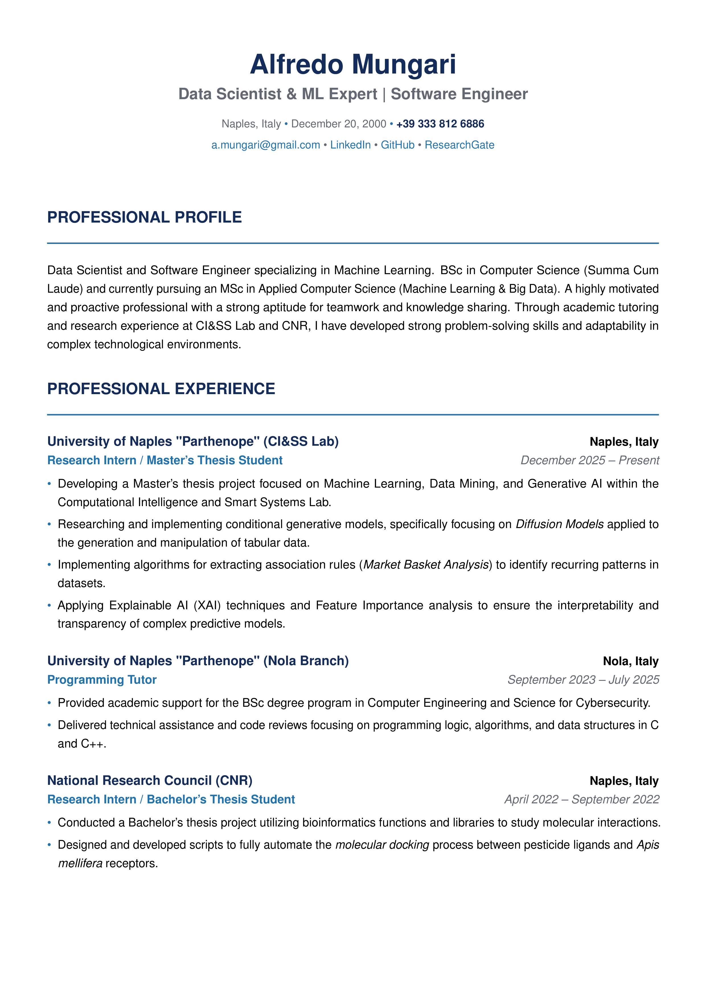
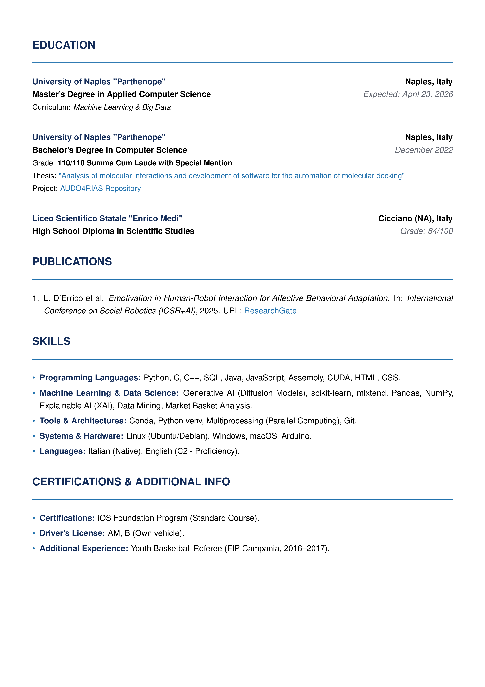

# Alfredo Mungari - Professional Resume

This repository contains the LaTeX source code and the final PDF version of my curriculum vitae.

[Download the PDF version](resume.pdf)

## Resume Preview

<p align="center">
  <a href="resume.pdf">
    
  </a>
  <a href="resume.pdf">
    
  </a>
</p>

## About Me

I am a Data Scientist and Software Engineer with a BSc in Computer Science (Summa Cum Laude) and I am currently completing my Master's Degree in Applied Computer Science (Machine Learning & Big Data) at Parthenope University in Naples (Expected Graduation: April 2026).

A bilingual (Italian native, English C2 Proficiency) professional, I am highly numerate, resourceful, and capable of working entirely on my own initiative while possessing excellent organizational and team-working abilities. With a strong foundation in problem-solving, I am accustomed to working under pressure and effectively managing dynamic project needs.

## Current Focus & Research

My academic research and technical expertise are heavily focused on advanced Artificial Intelligence applications:
* **Generative AI:** Study and implementation of conditional generative models, specifically focusing on Diffusion Models applied to tabular data.
* **Explainable AI (XAI):** Applying XAI techniques and Feature Importance analysis to ensure the interpretability and transparency of complex predictive models.
* **Data Mining:** Extracting association rules (Market Basket Analysis) to identify recurring patterns in large datasets.

## Technical Skills

* **Programming Languages:** Python, C, C++, SQL, Java, JavaScript, Assembly, CUDA.
* **Machine Learning & Data Science:** Generative AI (Diffusion Models), scikit-learn, mlxtend, Pandas, NumPy, XAI, Data Mining.
* **Tools & Architectures:** Conda, Python venv, Multiprocessing, Git.
* **OS & Hardware:** Linux (Ubuntu/Debian), Windows, macOS, Arduino.

## About the LaTeX Source Code

The CV was engineered to balance a premium typographic design with strict ATS (Applicant Tracking System) compatibility. 

Key features include:
* **100% ATS-Friendly:** Linear structure without complex tables to ensure flawless parsing.
* **Unicode Mapping:** Implementation of the `cmap` package for correct text extraction.
* **Advanced Typography:** Utilization of `microtype` for optimal text justification.

### How to compile
You can easily compile the source file `main.tex` using pdfLaTeX in your local environment:
```bash
pdflatex main.tex
```

## Contact
I am open to new opportunities and challenging projects. Feel free to reach out:

Email: a.mungari@gmail.com

LinkedIn: Alfredo Mungari

GitHub: mungowz

ResearchGate: Alfredo Mungari
